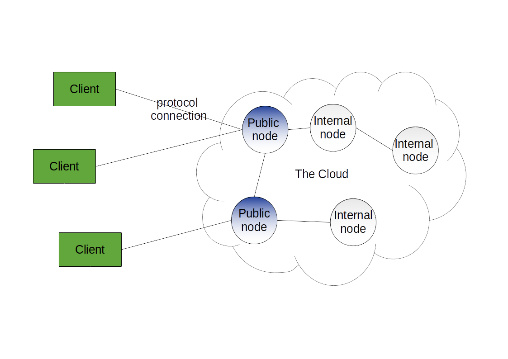
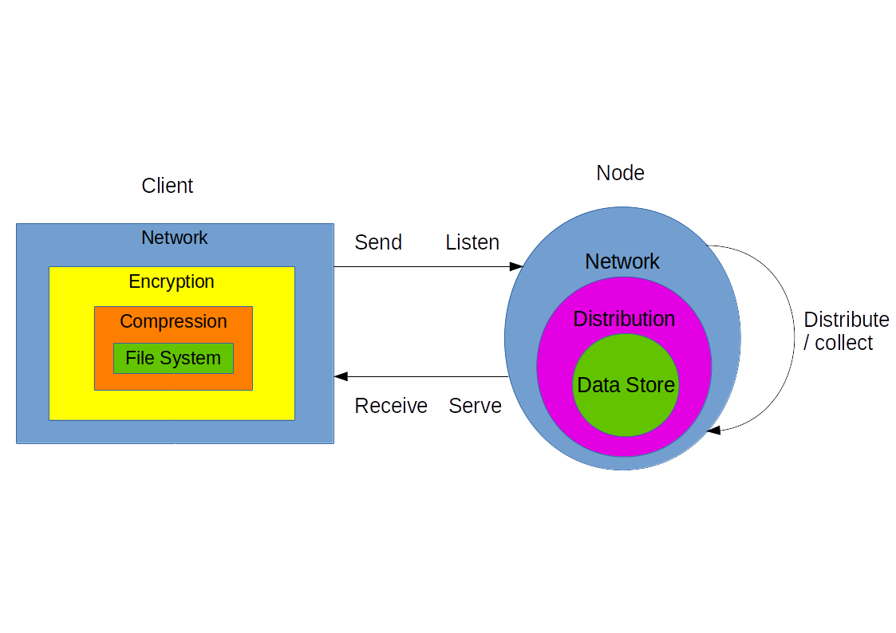
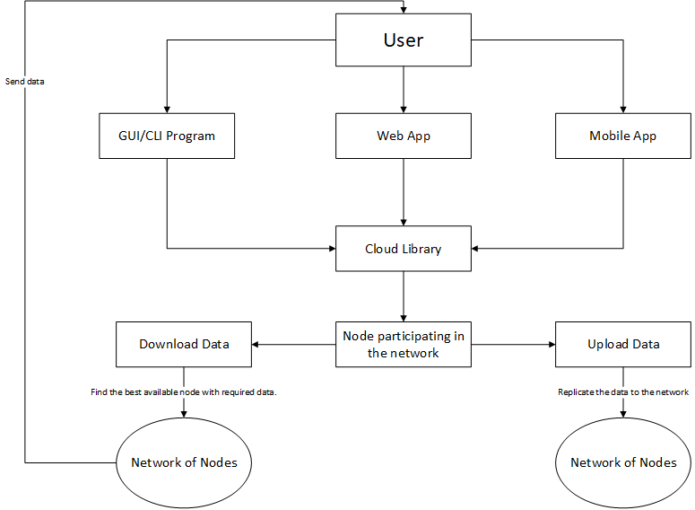
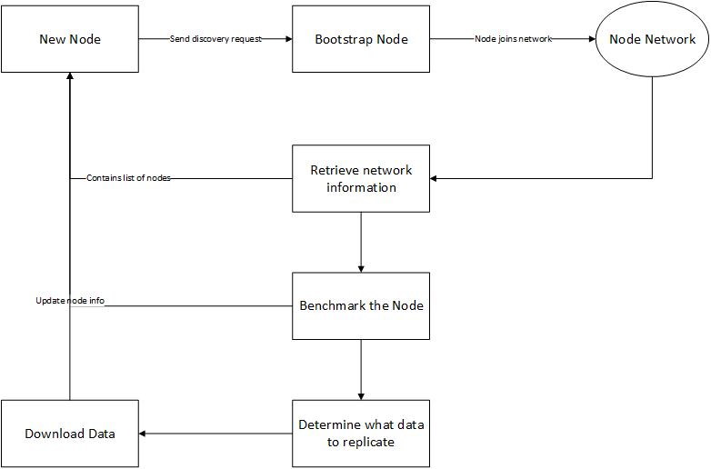

# Distributed Cloud Storage – Functional Specification

**Student Name:** Tomas Baltrunas
**Student Number:** 17350793

**Student Name:** Bartosz Śwituszak
**Student Number:** 17437072

**Supervisor:** Ray Walshe
**Date:** 06/12/2019

## 0. Table of contents

A table of contents with pages numbers indicated for all sections / headings should be included.

- [Distributed Cloud Storage – Functional Specification](#Distributed-Cloud-Storage-%E2%80%93-Functional-Specification)
	- [0. Table of contents](#0-Table-of-contents)
	- [1. Introduction](#1-Introduction)
		- [1.1 Overview](#11-Overview)
		- [1.2 Business Context](#12-Business-Context)
		- [1.3 Glossary (project-defined terms)](#13-Glossary-project-defined-terms)
		- [1.4 Glossary (other terms)](#14-Glossary-other-terms)
	- [2. General Description](#2-General-Description)
		- [2.1 Product / System Functions](#21-Product--System-Functions)
		- [2.2 User Characteristics and Objectives](#22-User-Characteristics-and-Objectives)
			- [Node Administrator](#Node-Administrator)
			- [End User](#End-User)
		- [2.3 Operational Scenarios](#23-Operational-Scenarios)
		- [2.4 Constraints](#24-Constraints)
			- [Speed](#Speed)
			- [Security](#Security)
			- [Data integrity](#Data-integrity)
			- [Operating Systems support](#Operating-Systems-support)
			- [Time](#Time)
	- [3. Functional Requirements](#3-Functional-Requirements)
	- [4. System Architecture](#4-System-Architecture)
		- [Top-level network architecture](#Top-level-network-architecture)
		- [Program architecture](#Program-architecture)
	- [5. High-Level Design](#5-High-Level-Design)
		- [User Data Flow Diagram](#User-Data-Flow-Diagram)
		- [Nodes Data Flow Diagram](#Nodes-Data-Flow-Diagram)
	- [6. Preliminary Schedule](#6-Preliminary-Schedule)
	- [7. Appendices](#7-Appendices)
		- [7.1 References](#71-References)

<small><i><a href='http://ecotrust-canada.github.io/markdown-toc/'>Table of contents generated with markdown-toc</a></i></small>

## 1. Introduction

### 1.1 Overview

Our project – Distributed Cloud Storage – is essentially your own Google Drive/DropBox/OneDrive. Using our software you can turn a private cloud network into a cloud storage platform. Simply configure our storage software on your "nodes" (networked computers capable of storing data) and use our client software to access the data on your cloud with a File Explorer-like interface.

Why? We only have to do a search for "google drive privacy" or "google drive breach" to see the amount of trust that we place into giant corporations like Google or Microsoft when we use their "free" services. We can not be sure that our data will not be used as part of an advertisement campaign or not get stolen through some cyber attack. Thus, we provide software that you can use on top of your own secure private network and be in control of your data, where the protection of your data is only limited to the protection of the network itself.

Our storage or "node" software will interact with the underlying operating systems of your nodes, be it Linux, Windows or Mac OS X, to carry out its networking, storage, and other ad hoc functions. On the client-side we will have graphical user interfaces for desktop, web, and mobile devices.

### 1.2 Business Context

To test our project in practice, we will need to use our own computers and rent servers to create a private cloud and turn it into a storage platform.

As students we can use various cloud computing services for free. GCP free tier always lets us create a compute engine instance (Windows/Linux VM). Azure provides free Linux and Windows VM's for the first twelve months, and so does AWS.

Products that propose an alternative to "cloud storage giants" already exist in the market. See [Storj](https://storj.io) and [Sia](https://sia.tech/) for examples. However, such products are paid and manage the underlying cloud network. Our business model would be to provide free unmanaged software and charge for tech support.

### 1.3 Glossary (project-defined terms)

**Cloud storage platform / Cloud** - network of computers accessible via the Internet that stores user data.

**Node** - any computer system that participates in the cloud storage platform. Including but not limited to virtual machines, servers, and PC's.

**Capable machine** - machine that could potentially be turned into a node, due to its storage and networking abilities.

**Node software** - program installed to turn a machine into a node.

**Host** - the machine on which node software is running, the node.

**Client / client software** - program that a user uses to access their files on the cloud.

**Active node** - node successfully participating in the cloud.

**Inactive node** - node that is currently not participating in the cloud, due to being offline or some technical problem.

**Data store** - the place where user data is stored on a node, such as a directory on the hard disk's file system.

### 1.4 Glossary (other terms)

**Go** - modern C-like general-purpose programming language. [golang.org](https://golang.org/)

**React Native** - framework for building hybrid (Android and iOS) mobile applications using JavaScript.

**VM** - virtual machine.

**GCP** - Google Cloud Platform, paid and free cloud services by Google.

**AWS** - Amazon Web Services, cloud services by Amazon.

**Azure** - Microsoft Azure, cloud services by Microsoft.

**Systemd** - Linux software for managing services (daemons).

## 2. General Description

### 2.1 Product / System Functions

The system comes in two parts:

* The "node" software.
* The "client" software.

**The "node" software** turns the machine it is running on into a participant of the cloud storage platform (a "node"). The machine must have the properties of a "node", including networking and storage capabilities.

After being configured the software will run as a daemon. 

There is no master server, that is a server that makes decisions on the network. Multiple nodes will create a decentralised network.

The following is an overview of it functionalities:

* Perform file IO - read and write data persistently on the node.
* Perform network IO - receive and send packets over the Internet.
* Distribute data - split a file and share it with other nodes.
* Replicate data - send a copy of data to another node for redundancy.
* Select the best node - benchmark other nodes to pick the node to send data to.
* Resolve concurrent modification - check with other nodes to see if a file modification is allowed.

**The "client" software** allows the "end user" to access their data stored on their cloud storage platform.

The "client" is proposed to be implemented on multiple platforms: on desktop as a program with a GUI, on the web as a web application with a server, and on mobile as an app.

The following is an overview of a client's functionalities:

* Authenticate a user - the user running the client is capable of supplying credentials to authenticate with the cloud storage platform.
* Provide a File Explorer - the user can access, organise, and modify the files on the cloud storage platform.
* Encrypt and decrypt data - encrypt data before sending it from client to storage, and decrypt data locally once it is downloaded from the storage platform.
* Compress and uncompress data - before sending data compress it, and decompress data upon download.

*See the Functional Requirements section for a detailed description of functionalities.*

### 2.2 User Characteristics and Objectives

We can identify two user groups in our user community:

1. Node Administrator.
2. End User.

#### Node Administrator

The Node Administrator sets up and manages nodes on the cloud storage platform. This may be a systems administrator, software developer, or a self-taught individual.

The Node Operator's objective is to turn a private cloud into a cloud storage platform by configuring the nodes on their cloud.

This user needs to have basic systems administration skills such as installing and configuring software through command-line interfaces, graphical user interfaces, and configuration files on Windows/Linux/Mac OS X platforms, on their desktop, VM, or a remote machine. The user does not necessarily need to have any domain-specific knowledge about cloud storage except for basic computing terms such as encryption, compression, and disk space.

The Node Operator's wish list includes:

* To download and install the node software conveniently.
* To configure the node through a GUI (desirable), CLI, or a config file.
* To ensure node software runs in the background at all times through a GUI/CLI (desirable) or OS-specific program such as systemd.
* To uninstall the software or delete the data stored easily and without unintended side effects.

#### End User

The End User accesses the cloud storage platform through a client program. This may be an employee or client in a business or a private individual.

The objective of the End User is to store their data on the cloud.

This user is non-technical and only needs basic computer skills. The user does not need to know anything about cloud storage.

The End User's wish list includes:

* To download, install, and launch the client software easily.
* To be able to authenticate with the cloud storage platform.
* To view, preview (desired), and download their files on the cloud.
* To upload, organise (desired), and delete their files on the cloud.
* To have quick response times from the cloud.
* To be able to encrypt their files.
* To be able to have access to their files reliably and at all times.

### 2.3 Operational Scenarios

**Scenario ID:** 1 
* **User Objective:** Add a machine to the cloud.
* **User Action:** User installs and configures node software on the machine, turning the machine into a *node*.
* **Comment:** The *nodes* self-organise with each other as long as they can reach each other over the Internet. The new node will start downloading a copy of some data.

**Scenario ID:** 2
* **User Objective:** Remove a machine from the cloud.
* **User Action:** User follows the procedure to uninstall node software.
* **Comment:** Behind the scenes the cloud may redistribute data.

**Scenario ID:** 3
* **User Objective:** Authenticate with the cloud.
* **User Action:** The user opens a client and uses the built-in authentication mechanism.
* **Comment:** N/A.

**Scenario ID:** 4
* **User Objective:** View files on the cloud.
* **User Action:** Using a client the user opens the file explorer interface and sees the files that are currently on the cloud.
* **Comment:** N/A.

**Scenario ID:** 5
* **User Objective:** Upload a file to the cloud.
* **User Action:** Using a client the user selects their file from the client file explorer, selects destination directory if any, initiates the upload, and sees the file appear in the cloud file viewer.
* **Comment:** N/A.

**Scenario ID:** 6
* **User Objective:** Download a file from the cloud.
* **User Action:** Using a client the user selects a file, initiates the download, and receives the file on their local file system.
* **Comment:** The nodes determine the best node to download the file from based on availability, latency and available bandwidth.

**Scenario ID:** 7
* **User Objective:** Organise files on the cloud into directories.
* **User Action:** Using a client the user creates/updates/deletes directories via the client file explorer interface.
* **Comment:** Directories are a "nice to have" feature and are not essential to the system.

**Scenario ID:** 8
* **User Objective:** Modify the same file concurrently.
* **User Action:** Two users proceed to upload different versions of the same file at the same time. The cloud either accepts one change or both if possible.
* **Comment:** The first change that gets 51% of the nodes approve the change is the one committed. Ideally, if possible, merge the changes together. Merging files together is low priority, but cloud deciding on a change is high priority to handle race conditions.

### 2.4 Constraints

#### Speed

The users expect the reading and writing of data to the cloud to be as fast as possible. Thus we must use node benchmarking and compression to speed the process up. We will need to benchmark available bandwith of nodes and their latencies, while monitoring current usage to determine the best node to communicate with the user.

#### Security

We boast of privacy and control, therefore we must upkeep it with encryption. All of the files have to be transfered securely and all users have to be securely authenticated.

#### Data integrity

Some data is priceless. We must take every step to ensure data redundancy in case of node failure. We aim to keep every data available on as many nodes as possible. We will also rank nodes in terms of availability. Ideally every piece of data will be present in the most available nodes.

#### Operating Systems support

We must support Linux, Windows, and Mac OS X for our nodes and desktop client software. We must support Android and iOS for our mobile client software. We will prioritise Linux and Windows support at first as that is the operating system of most servers. Through the use of portable technologies like Go or React Native we may not need additional coding for different hardware, but our testing may be limited to the hardware that we own as a team.

#### Time

There may not be enough time for everything

* One of the team members is not as experienced at Go.
* The team will have to desing some networking protocols, which may be difficult.
* The team will have to design routing and data sharding between the nodes based on many factors.
* The team will have to implement rebalancing in the network based on the current usage and the available nodes.
* The team may not be as experienced at desktop GUI applications, web and mobile development.
* A plethora of clients could be created. If there is not enough time we may not implement the mobile client and/or the web client.

## 3. Functional Requirements

This section lists the functional requirements in ranked order. Functional requirements describes the possible effects of a software system, in other words, what the system must accomplish. Other kinds of requirements (such as interface requirements, performance requirements, or reliability requirements) describe how the system accomplishes its functional requirements.

**Requirement ID:** 1
* **Description:** Node networking, including listening for requests, sending back responses, initiating connections with other nodes, and accepting streams of data.
* **Criticality:** Very high. Network IO is an essential component for this project.
* **Technical issues:** Nodes must be reachable by IP address and port number, i.e. be on a private network or port forwarded.
* **Dependencies:** N/A.

**Requirement ID:** 2
* **Description:** Node set up, including storage allocation.
* **Criticality:** Very high. If there are no active nodes, then the cloud storage platform can not be used. Limited nodes available will limit the redundancy of data and the speed of the network.
* **Technical issues:** N/A.
* **Dependencies:** Node networking.

**Requirement ID:** 3
* **Description:** Node update status to the cloud, including its state (*active*/*inactive*), availability, free space left, latency, available bandwidth, current bandwidth, region, etc.
* **Criticality:** Very high. If a node suddenly goes down this puts a risk to losing data. Also, knowing performance information about nodes is important for routing data through the network.
* **Technical issues:** Communicating information with all nodes efficiently. 
* **Dependencies:** Node set up.

**Requirement ID:** 4
* **Description:** Node distribute file across the cloud. This includes: 1. Splitting the file contents into chunks. 2. Replicating each chunk. 3. Distributing replicas to other nodes making the file redundant.
* **Criticality:** Very high. Distributing a file is essential for data redundancy.
* **Technical issues:** Managing the distribution of a single file is a complex routine with multiple steps. We need to think about whether to store only file contents or also file metadata. Also if only certain file chunks have changed, we do not need to change other chunks.
* **Dependencies:** Node set up, node status update.

**Requirement ID:** 5
* **Description:** Node accept file from client and distribute file on the cloud.
* **Criticality:** Very high. One of the core functionalities of this project.
* **Technical issues:** Will need to call the "distribute file" routine.
* **Dependencies:** Node distribute file.

**Requirement ID:** 6
* **Description:** Node collect and serve file (contents or metadata) to client.
* **Criticality:** Very high. The user must view and download whatever they uploaded to the cloud. Collecting back chunks of a file well is important for performance and data integrity.
* **Technical issues:** Collecting the file's chunks from remote locations is a complex task.
* **Dependencies:** Node accept file from client.

**Requirement ID:** 7
* **Description:** Node daemonization, where the node software always runs as a background process and is managed by some daemon tool.
* **Criticality:** High. The node process is directly responsible for the availability of the node itself.
* **Technical issues:** Node software must be high performance to not unnecessarily use resources on its host machine. 
* **Dependencies:** N/A.

**Requirement ID:** 8
* **Description:** Node uninstall software by shutting down the node and deleting all data on the host's data store.
* **Criticality:** High. Cleanly uninstalling software is an important feature for users.
* **Technical issues:** Communicating node uninstall to other nodes and moving data to other nodes to ensure no data loss.
* **Dependencies:** Node set up, node distribute file.

**Requirement ID:** 9
* **Description:** Node configuration ability, including modifying the allocated storage space, network limits, etc.
* **Criticality:** Medium. This is a convenient feature.
* **Technical issues:** Node must be able to pick up the changes effectively without any or long downtime. Node has to rebalance it's data based on new storage space and network performance.
* **Dependencies:** Node set up.

**Requirement ID:** 10
* **Description:** Node handle changes in case multiple users modify the same file.
* **Criticality:** Low. This is a proposed enhancement where multiple users share the same files and perform a concurrent write.
* **Technical issues:** We have to think about how to resolve concurrency conflicts.
* **Dependencies:** Node accept file, node serve file.

**Requirement ID:** 11
* **Description:** Client connect and authenticate to the cloud.
* **Criticality:** Very high. We must ensure that the cloud is reachable by external machines but also that whoever connects is authorised to access the cloud.
* **Technical issues:**  Certain nodes on the cloud must be "public" while others can be private. We can also add a reverse proxy or load balancer.
* **Dependencies:** Cloud is reachable to the public.

**Requirement ID:** 12
* **Description:** Client file explorer with CRUD operations, including ability to create (upload), read (view metadata and download), update, and delete files through a UI.
* **Criticality:** Very high. This is how the user primarily interacts with the cloud.
* **Technical issues:** N/A.
* **Dependencies:** Cloud is functional.

**Requirement ID:** 13
* **Description:** Client file explorer with CRUD on directories, with ability to create, list and view contents of, rename and add new files to, and delete directories.
* **Criticality:** High. Without a directory structure soon a user's files will become unmanageable.
* **Technical issues:** Adding directory support on the cloud side, i.e. is a directory just another type of file?
* **Dependencies:** Client files CRUD.

**Requirement ID:** 14
* **Description:**  Client viewer to preview file contents for certain file types such as PDF, text files, etc.
* **Criticality:** Low. This is a convenient feature but not a priority.
* **Technical issues:** Do we use third-party components for viewers or write our own?
* **Dependencies:** Client files CRUD.

**Requirement ID:** 15
* **Description:** Client encrypt files before sending and decrypt files upon receipt.
* **Criticality:** High. If a node gets compromised but its data store is encrypted, the user's data will likely not be compromised.
* **Technical issues:** Which encryption method to use. How to distribute keys in case of multiple users.
* **Dependencies:** N/A.

**Requirement ID:** 16
* **Description:** Client compress files before sending and uncompress at reception.
* **Criticality:** High. Compression reduces file size and thus improves the cloud performance as network bandwidth will most likely be the bottleneck.
* **Technical issues:** Which compression codecs to use for which file types.
* **Dependencies:** N/A.

**Requirement ID:** 17
* **Description:** Cache files that are frequently previewed or downloaded on the client host for quick access.
* **Criticality:** Medium. This is a desired but not critical requirement.
* **Technical issues:** Invalidating the cache.
* **Dependencies:** Client preview files, client CRUD on files.

## 4. System Architecture

This section describes a high-level overview of the anticipated system architecture showing the distribution functions across (potential) system modules. Architectural components that are reused or 3rd party should be highlighted.

### Top-level network architecture

The following diagram illustrates the top-level network architecture:

(The diagram can also be found at https://gitlab.computing.dcu.ie/baltrut2/2020-ca326-tbaltrunas-cloudstorage/raw/master/functional_spec/sys-arch-top-level.png)

In this diagram, we illustrate how user machines are classified and networked. First we have one or more *client* machines (they run client software and end-users use these machines to access the cloud). The client machines connect to the *cloud*, a set of *nodes* that create a *cloud storage platform*. In particular, the cloud consists of two types of nodes — *public nodes* and *internal nodes*. Public nodes are accessible through the Internet. Clients connect to **one** of the public nodes to access the cloud (a later enhancement would be to let the client connect to many nodes at a time, or have a reverse proxy/load balancer in front of all the nodes). Internal nodes are private to the cloud network (not accessible through Internet) but other nodes can connect to them. Thus, public nodes act as servers or gateways, while internal nodes make the cloud more performant. There is a direct or indirect path between every node (similar to Internet routing, not every node has to be connect to every other node, but nodes can connect through intermediaries).

The protocol used for connections will be a custom application-level protocol. However, the protocol will most likely use TCP for its transport layer.

### Program architecture

The following diagram illustrates the program architectures:

(The diagram can also be found at https://gitlab.computing.dcu.ie/baltrut2/2020-ca326-tbaltrunas-cloudstorage/raw/master/functional_spec/sys-arch-prog.png)

In the diagram above, we can see the architectures of both the client and the node software. We have decided that both programs will be layered. Certain layers are essential while others are optional.

In the case of client, these are the layers from innermost to the outermost:

* **File System layer:** interacts with the local file system to read and write files.
* **Compression layer (optional):** compresses and decompresses files.
* **Encryption layer (optional):** encrypts and decrypts files.
* **Network layer:** interacts with the outside world (the cloud).

The following are the layers for the node software, from the innermost to the outermost:

* **Data Store layer:** persistently stores and retrieves chunks of files.
* **Distribution layer:** manages file splitting and replication. Collects files from other nodes. Keeps an internal state of a list of other nodes and locations of file chunks.
* **Network layer:** Interacts with the outside world (clients and other nodes).

The client and the node applications will interact with each other only through the network layers. Specifically, the client will send and receive files or other metadata. The nodes will listen for client requests and serve those requests with a response. The nodes will interact between each other by distributing chunks or replicas of a file received. The nodes will also interact by collecting chunks of a file from other nodes in order to serve it.

## 5. High-Level Design

### User Data Flow Diagram

The following diagram illustrates the user data flow diagram:

(The diagram can also be found at https://gitlab.computing.dcu.ie/baltrut2/2020-ca326-tbaltrunas-cloudstorage/raw/master/functional_spec/using-cloud.png)

The User will utilize the cloud using either a GUI/CLI Program, Web App or a Mobile App. Those Programs/Apps will utilize our library to communicate with the node network.

The library will use one node on the network as it's communicating point. The node will then communicate with the rest of the network as needed.

When the user wishes to upload a file, the node will inform the network of what files will be affected. Once the network approves of the change, the user starts uploading the data to the node. This node will start replicating the data to other nodes.

When the user requests to download any data, the node determines which nodes have that data and uses their benchmark information to determine which nodes will be the fastest. The user downloads the data from the nodes.

### Nodes Data Flow Diagram

The following diagram illustrates the node data flow diagram:

(The diagram can also be found at https://gitlab.computing.dcu.ie/baltrut2/2020-ca326-tbaltrunas-cloudstorage/raw/master/functional_spec/nodes-dfd.png)

The new node starts by contacting a bootstrap node, a node already in the network, with the request to join the network. The bootstrap node authenticates the new node, and if approved, sends the network information (e.g list of nodes) to the new node. The bootstrap node informs the network of the new node.

The new node is then benchmarked by the network. It's latency, bandwidth and capacity are all tested and the results are saved.

The results of this benchmark are then used to determine what data should be replicated to the nodes.

The data is then transmitted to the new node.

## 6. Preliminary Schedule

This section provides an initial version of the project plan, including the major tasks to be accomplished, their interdependencies, and their tentative start/stop dates. The plan also includes information on hardware, software, and wetware resource requirements.

The project plan should be accompanied by one or more PERT or GANTT charts.

The following is a GANTT chart of our proposed schedule:

| Task Name | Duration | Length | Start | Finish | Assignees |
| --------- | -------- | ------ | ----- | ------ | --------- |
N network
N data store
N distribution
DC network
DC file system
DC GUI
DC compression
DC encryption
WC network
WC file system
WC compression
WC encryption
MC network
MC file system
MC compression
MC encryption

N = Node
DC = desktop client
WC = web client
MC = mobile client

## 7. Appendices

Specifies other useful information for understanding the requirements. 

### 7.1 References

* https://cloud.google.com/free/ - Google Cloud Platform free tier.
* https://azure.microsoft.com/en-us/free/free-account-faq/ - Microsoft Azure free tier.
* https://aws.amazon.com/free/ - AWS free tier.
* https://facebook.github.io/react-native/docs/out-of-tree-platforms - React Native platform support.	