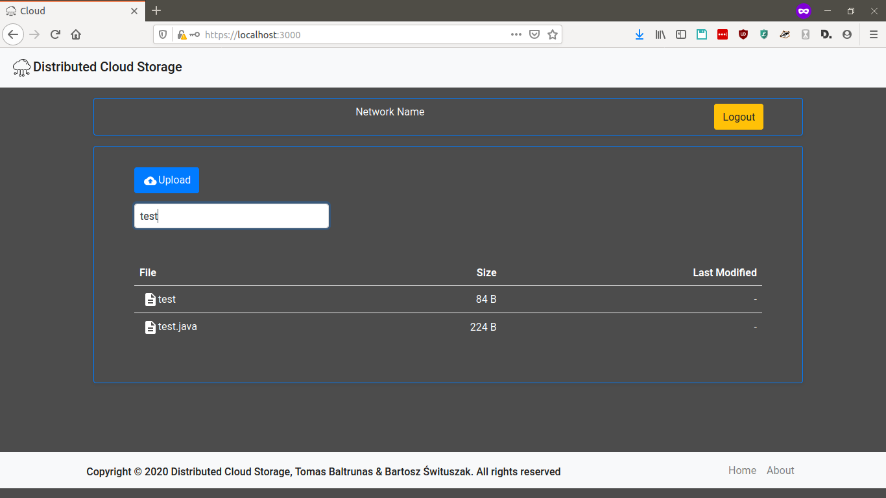

# Distributed Cloud Storage – User Manual

<!-- This is a 5 to 10 page user instruction guide on how to use the software system. It should include a step by step guide on how to use the product major components and should be written for a user and not technical audience (unless the system/product is intended for use by technical persons). You may consider including screen shots.  -->

## Table of Contents

- 1. Preface
- 2. Node Administrator Guide
  - 2.1. Cloud set up (command-line interface)
  - 2.2. Cloud set up (desktop graphical user interface)
  - 2.3. Website client set up
- 3. End User Guide
  - 3.1. Desktop client
  - 3.2. Website client
- 4. Other

## 1. Preface

This is a guide for our two primary users - node administrator and end-user.

We present how to set up the cloud, and how to use it with desktop and website clients.

## 2. Node Administrator Guide

Node administrator will set up the cloud on nodes (machines or servers).

The node administrator will also set up the web client.

Software is OS-independent. 

### 2.1. Cloud set up (command-line interface)

Get a copy of our cloud binary.

#### Generate encryption keys

`ssh-keygen -f id_rsa -m PEM -q -N`

We require PEM-format keys.

#### Create a cloud

Initialize first node to create a cloud.

```
cloud -key id_rsa -name "Node 0" \
        -save-file save \
        -whitelist-file whitelist \
        -fancy-display -verbose \
        -log-level "DEBUG" -log-dir $LOGSDIR \
        -file-storage-capacity 100000 \
        -file-storage-dir data
```

Connect other nodes

```
cloud -key id_rsa -name "Node 1" \
        -save-file save \
        -network "bootstrapnode.address.com" \
        -fancy-display -verbose \
        -log-level "DEBUG" -log-dir $LOGSDIR \
        -file-storage-capacity 100000 \ 
        -file-storage-dir data
```

The important part is the `-network` flag which tells the address of a node already in the network.

See `cloud -h` for a detailed list of available flags.

### 2.2. Cloud set up (desktop graphical user interface)

Obtain a binary of the desktop GUI, which is the same as for the end user.

#### Set up a cloud or connect to an existing cloud

Follow instructions on screen

#### See administrative information of a node

See chunk distribution, etc.

### Website client set up

Set up a website client for end-users.

#### 5.3.1. Web Application

Set up the cloud as per the previous sections.

**1. Run the cloud binary with web app enabled**

Pass the `-web-backend` switch (optionally with `-web-backend-port port` to specify port).

For example:
```
./cloud -key ~/.ssh/id_rsa -web-backend
```

**2. Install and set up PostgreSQL**

See [https://www.postgresql.org/]()

Set up a user and a database for the cloud with `psql`.

Make sure PostgreSQL is running.

**3. Create a database**

Apply the schema found at `code/cloud/webapp/cloud.sql` (starting from the root of the repo).

This will create a users table.

Use `psql` and bcrypt to create a new user.

**4. Obtain HTTPS TLS certificates**

Download a certificate you own or generate a self-signed certificate.

**5. Create a .env file**

Use the following example:
```
JWT_KEY=mybigtimesecret

SSL_CRT_FILE=cert.crt
SSL_KEY_FILE=cert.key

DB_TYPE=postgres
DB_HOST=localhost
DB_PORT=5434
DB_NAME=cloud
DB_USER=cloud_admin
DB_PASSWORD=root
```

#### 5.3.2. Web Server

The following assumes that you will use the create-react-app ([https://github.com/facebook/create-react-app]()) web server.

**1. Install npm**

Install the node package manager from https://www.npmjs.com/.

**2. Install front-end dependencies**

Navigate to the front-end source in the repo: `cd code/web-client`.

Run `npm install` to install dependencies.

**3. Create a .env file**

Follow this example:
```
HTTPS=true
SSL_CRT_FILE=cert.crt
SSL_KEY_FILE=cert.key
```

**4. Start the web server**

Run `npm start` (or `make` with the Unix `Make` tool).

## 3. End User Guide

User that wishes to store files on the cloud.

### 3.1. Desktop client

#### Prerequisites
    
Use the desktop binary provided. Supports Windows, Linux and Mac OS X.

Requires a graphics driver to be installed to run.

#### Manage files

The main overview of the file explorer in the desktop GUI looks like this:


You can navigate through folders by double clicking on them.

Each file has 3 main operations. Sync, Download and Delete.

The sync option, will create a sync between the cloud file and a file locally stored on the system. This sync acts similarly to a symlink. Any change to the file locally will be reflected on the cloud, as well as any changes to the file on the cloud will be reflected locally.

The download option downloads the file from the cloud to a local file. It will download the file chunks from any node that contains it.

The final operation, is the delete operation. This deletes the file from the cloud.

Additionally, at the bottom of the window, there are 2 buttons. `Add` and `Sync`.

The `Add` button will upload a selected file from the local system to the cloud.
The `Sync` button will upload the selected file to the cloud, and create a link between the local version and the cloud version.

#### Manage directories

There are 2 main operations for the folder.

The sync operation on the folder, will sync the cloud folder to a local folder. Similarly to a file sync, but instead it syncs the folder. This is also like Google Drive, Dropbox, etc... where you have a local folder being synced with the cloud. Any changes to the folder and files inside it, will be kept up to date with the cloud.

The other operation is deleting a folder. The folder has to be empty to be deleted.

### 3.2. Website client

The website client exposes a File Explorer UI to the storage cloud through the web.

Enter the website address into a web browser to access the website.

#### Log in

Enter your username and password.

The credentials will be provided by administrator.


#### Home screen

You will find yourself at the home screen.

At the top you can see the name of your network and a button to logout.

The main part of the home screen is the file explorer, where you can manage your files and directories.


#### Upload a file

Add a file by clicking the upload button or by dragging and dropping the file into the file explorer window.


We now have added a file and can see its attributes such as size.

#### Download a file

We can download a file by selecting the file and clicking the download button that appears.


#### Other file operations

We can double click on a file to have a more detailed view.

We can also rename and delete files using the provided buttons.


#### Manage folders

We can create, rename, and delete folders (directories). We can move files into and out of folders.


#### Search files

Additionally we can search the available files by filename.



## 4. Other

For more information see the technical manual, the source code, or contact the support team.
